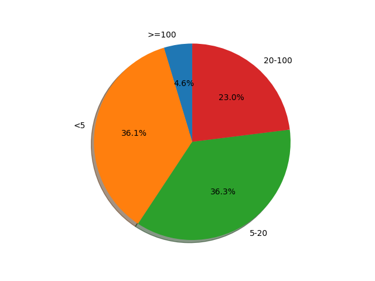
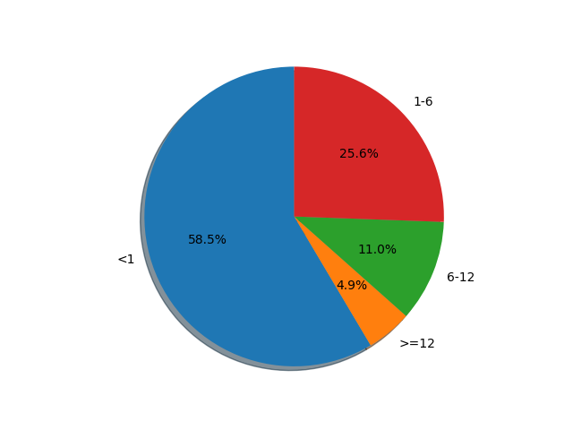
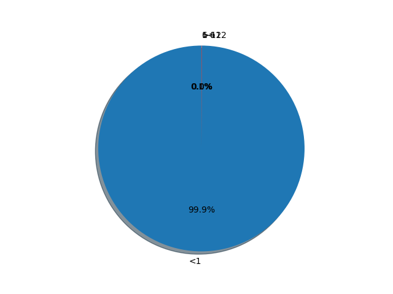

# Testassigment Geodata
Test assigment on Microsoft Geolife Dataset

## How It Works

Testassigment is based on [Microsoft Geolife Dataset](https://www.microsoft.com/en-us/research/publication/geolife-gps-trajectory-dataset-user-guide/)

Testassigment consist of 4 python modules in geo_app/geo folder and tests:

**ingest.py** - by default read Geolife data from local folder geo_data_source, transform it and save it as geo_table.parquet file to local folder geo_data_output, or input_folder and output_folder should be provided

**length_dist.py** - by default read geo_table.parquet file (from ingestion stage) as a SQL table from local folder geo_data_output.
Calculate distribution of trip length in km and save it to local folder geo_data_output as

length_{timestamp}.csv

length_{timestamp}.png

**time_gross_dist.py** - by default read geo_table.parquet file (from ingestion stage) as a SQL table from local folder geo_data_output.
Calculate distribution of trip duration time in hours and save it to local folder geo_data_output as

time_gross_{timestamp}.csv

time_gross_{timestamp}.png

**time_net_dist.py** - by default read geo_table.parquet file (from ingestion stage) as a SQL table from local folder geo_data_output.
Calculate distribution of trip duration time without stops in hours and save it to local folder geo_data_output as

time_net_{timestamp}.csv

time_net_{timestamp}.png

Human stops were defined as trajectory steps where speed was less than 0.05 km/h

## Schema 

IngestionTime: TimestampType,  
UserId: StringType,  
TrajectoryID: StringType,  
Latitude: DoubleType,  
Longitude: DoubleType,  
Altitude: DoubleType,  
StepTimestamp: TimestampType,  
Label: IntegerType

IngestionTime - data ingestion time, the same time is added to all input data while the script is running  

UserId - folder name in Geo Dataset: Geolife Trajectories 1.3/Data/{users}

TrajectoryID - file name of .plt file in Geo Dataset: Geolife Trajectories 1.3/Data/{user}/Trajectory/{.plt}

Latitude - the first column from plt file

Longitude - the second column from plt file

Altitude - the forth column from plt file

StepTimestamp - comdined 6th and 7th columns from file as timestamp = data + time

Label - merged labels as categories from labels.txt file. Merged by time

3th and and 5th columns from plt according to Geo Dataset User Guide are useless

## Getting started

1. Load Microsoft Geolife Dataset](https://www.microsoft.com/en-us/research/publication/geolife-gps-trajectory-dataset-user-guide/) and unpack it to geo_data_source. It's a default local folder for input data.
You can create your own directory and then use param --input_folder for all scripts

2. Install [Python 3.8](https://www.python.org/downloads/release/python-380/)

3. Create Python enviroment

`cd geo_app

python3 -m venv geo_env

source geo_env/bin/activate`

4. Install requirements.txt from geo_app folder

`pip install -r requirements.txt`

5. Run Ingest.py from geo_app/geo folder

default folders:

`python3 ingest.py`

custom local folders:

`python3 ingest.py --input_folder ../../test_data --output_folder ../../geo_data_output_test`

6. Check geo_data_output or your output table for geo_table.parquet

7. Run length_dist.py from geo_app/geo folder

default folders:

`python3 ingest.py`

custom local folders:

`python3 length_dist.py --database_folder ../../geo_data_output_test`

8. Look at geo_data_output or your output table. You will see 2 new files:
length_{timestamp}.csv
length_{timestamp}.png

9. Run time_gross_dist.py from geo_app/geo folder

default folders:

`python3 time_gross_dist.py`

custom local folders:

`python3 time_gross_dist.py --database_folder ../../geo_data_output_test`

10. Look at geo_data_output or your output table. You will see 2 new files:
time_gross_{timestamp}.csv
time_gross_{timestamp}.png

11. Run time_net_dist.py from geo_app/geo folder

default folders:

`python3 time_net_dist.py`

custom local folders:

`python3 time_net_dist.py --database_folder ../../geo_data_output_test`

12. Look at geo_data_output or your output table. You will see 2 new files:

time_net_{timestamp}.csv
time_net_{timestamp}.png

## How to run tests

`cd geo_app\geo
pytest`

## Results

#### Trip length Distribution, KM

#### Gross Time Distribution, H

#### Net Time Distribution, H

